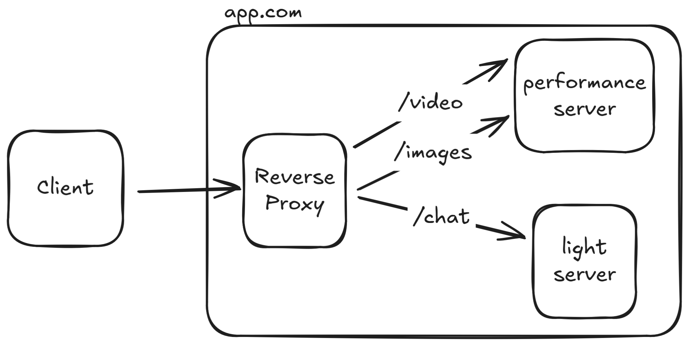

# Go Reverse proxy

This is a small implementation of a reverse proxy in go. I made this for
learning purposes, both to get experience with the language and learn how a
reverse proxy works.

## What is a reverse proxy?

A reverse proxy is a system that sits between the client request and your
applications, it let's you handle traffic to different parts of your
application. For example, you can host your images and chat services in
different servers while your client is just accessing a different route in the
same domain `app/images` or `app/chat`. 



In this image we see the reverse proxy withing the application network, which
handles the traffic to a light or performance server based on the client
request.

## Running

Clone the repository

```bash
git clone https://github.com/axiomcat/go-reverse-proxy.git
cd go-reverse-proxy
```

Build the docker compose file

```bash
docker compose up
```

This setup uses the conifg in `config/config-docker.yml` and sets up the
internal api at `42007`.

## Config

You can use the `config.yml` to configure the routing for the proxy server.
You can add either tcp or http routes, although http has more options like
prefix path and shutdown timeout.

Note that the rules for http are applied in the order they are written, in this
example config for the admin  host we match `/users` to a path and use a default
target for other paths.

```yml
---
tcp:
  target: "localhost:8080"
  port: ":8020"

http_routes:
  - target: "http://localhost:8081"
    host: "localhost"

  - target: "http://localhost:8083"
    host: "admin.localhost"
    path_prefix: "/users"

  - target: "http://localhost:8084"
    host: "admin.localhost"
    path_prefix: "/"

http_config:
  port: ":8021"
  shutdown_timeout: "5s"

log_level: "debug"
```

## Internal API 

By default this proxy uses the port `42007` to expose two internal endpoints,
`/reload` and `/metrics`.

### /reload

When you make a request to this endpoint it will stop the current servers and
start new ones reading the config again.

### /metrics

This endpoint exposes metrics for the proxy that can be uses in prometheus.
With docker composer you can start a prometheus server at `9091` where you
can find these metrics:

```
tcp_connections_active_count
tcp_connections_total_count
http_request_time_avg_milliseconds
http_request_total_count
```
